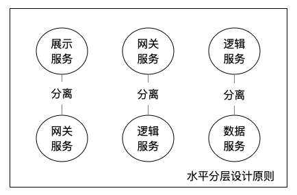

## 架构设计（一）

##### 目标：

- 架构完整解决方案

  - 具体业务场景
    - 设计阶段的解决方案
    - 实际代码的解决方案
    - 线上问题的解决放哪
    - 拆分解决方案的点
  - 架构如何选型
  - 架构如何设计
  - 架构如何折中
  - 架构如何落地

- 架构后的哲学思想

  - 为什么要这么设计
  - 其他方案为啥不够优雅

  

##### 要点：快速迭代，持续交付

##### 架构设计三个阶段：

- 单体阶段
- 微服务阶段
- 服务网格

##### 水平分层架构：

设计原则：

- 网关层
  - 1. 请求鉴权
    2. 数据完整性验证
       1. 数据包定长Header和变长Body
    3. 协议转换
       1. Https -> 网关 -> TCP - protobuf -> 业务1 - protobuf -> 业务2 -> SQL97 -> 数据库
    4. 路由转发
       1. 根据Header中的cmd转发到不同业务逻辑层
    5. 服务治理
       1. 限流、熔断、降级等
- 业务逻辑层
- 数据访问层
  - 1. CRUD
    2. ORM（MyBatis）
    3. Sharding（Sharding-JDBC）
       1. RDBMS
       2. NoSQL
       3. NewSQL（TiDB：单库存储理论上无上限：千亿数据量查询4毫秒）
          1. 参考：转转公司对TiDB的实践
    4. 屏蔽底层存储差异
       1. MySQL、MongoDB、Redis等

